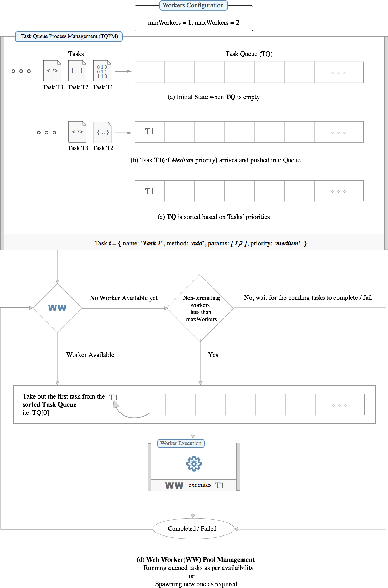

## change link - https://raw.githubusercontent.com/softvar/super-workerss/master/super-workerss.png

<h1 align="center">super-workers</h1>

<div align="center">
  
</div>
<div align="center">
  <strong>Distribute load on front-end via parallelism</strong>
</div>
<div align="center">
  A <code>11kb</code> lib for making multi-threading tasks easy on front-end
</div>

<div align="center">
  <h3>
    <a href="http://varunmalhotra.xyz/super-workers">
      Website
    </a>
    <span> | </span>
    <a href="http://varunmalhotra.xyz/super-workers#live-demo">
      Live Demo
    </a>
    <span> | </span>
    <a href="https://github.com/softvar/super-workers#contributing">
      Contributing
    </a>
    <span> | </span>
    <a href="http://webchat.freenode.net?channels=super-workers&uio=d4">
      Chat
    </a>
  </h3>
</div>

<br />
<br />

[](https://www.npmjs.com/package/super-workers) [](https://www.npmjs.com/package/super-workers) [](http://travis-ci.org/softvar/super-workers) [](https://coveralls.io/github/softvar/super-workers?branch=master)  

<!-- [](https://nodei.co/npm/super-workers/) -->

<!-- <a href="https://news.ycombinator.com/item?id=14041400"></a>
<a href="https://www.producthunt.com/posts/super-workerss"></a> -->

### Table of Contents
* [Features](#features)
* [Installation](#installation)
* [Flow diagram](#flow-diagram)
* [Usage](#usage)
* [API](#api)
* [Browser support](#browser-support)
* [Development Stack](#development-stack)
* [Process](#process)
* [Scripts](#scripts)
* [Contributing](#contributing)
* [Authors](#authors)
* [Copyright and license](#copyright-and-license)

### Features

1. Run multipe tasks parallely without blocking the main thread.
2. Jank-free pages since all the computations take place in worker-thread and not in main-thread (thereby speed and performance at the same time).
3. On-demand initialization of web-workers based on task-queue size. Configure minimum and maximum number of web-workers or let library smartly decide based on hardware concurrency number.
4. Configure task(set priority, time-to-live) and *Priority Task Queue Management System(PTQMS)* will take care of the queue handling and execution.
5. Termination of idle(non-used) web-workers for better performance(can be opt-out while configuring). Set minimum number of web-workers to restrict their termination when idle, so that they remain present for future needs.
6. Fully fledged API to get all the information regarding tasks and workers at any given point of time.
7. Promise based execution of tasks i.e. perform different actions on success or failure. Useful for re-attempting failed task.
8. Define callbacks to be get triggered at various events. Eg. on successful execution of task, on exceeding the time limit of task execution, etc.
9. Exports in a UMD format i.e. library works everywhere (nodejs doesn't have the concept of workers but have child-process concept which is not handled in this lib).
10. Only `~5.5 KB` gzipped.

### Installation

1. Via [npm](https://www.npmjs.com/)

```
$ npm install super-workers
```

2. Via [yarn](https://yarnpkg.com/en/)

```
$ yarn install super-workers
```

3. Via [bower](https://bower.io/)

```
$ bower install super-workers
```

4. Download source - [Link](https://github.com/softvar/super-workers/archive/1.0.0.tar.gz)

<!-- 3. Via [cdnjs](https://cdnjs.com), using `<script>` tag

```
<script type="text/javascript" src="https://cdnjs.cloudflare.com/ajax/libs/super-workers/1.0.0/super-workers.min.js"></script>
```

**Note**: Use the desired version of the library in place of `1.0.0`. Checkout [cdnjs super-workerss](https://cdnjs.com/libraries/super-workerss). -->

### Flow Diagram

**Aim** - To be able to run multiple tasks simultaneously without freezing the web-page

- Tasks are queued as they arrive.
- Task Queue Process Management(TQPM) processes the queue and based on tasks' priority, it reorders the queue.
- Workers are spawned as and when required based on number of tasks and configuration.
- Availability of workers decide the number of tasks getting processed.
- Completion of a task allow the next queued task to be get executed.

Below diagram will aid in understanding the flow better

<!-- https://raw.githubusercontent.com/softvar/super-workerss/master/parent-tab-communication.jpg -->


---

#### Explanation of diagram

***Setting the workers configuration***

Lets have the following worker configuration:

- minimum number of workers always available to execute tasks - `minWorkers = 1`
- maximum number of workers that should be spwaned irrespective of the number of tasks in the queue - `maxWorkers = 3`. This number will restrict registering of workers more than this number. We can not set this number randomly since it depend on the number of cores in a machine. By default, the library will pick it for you using `navigator.hardwareConcurrency` or it's polyfill. Setting it too high will not boost queue processing as it becomes constant after the threshold(totally depends upon the hardware configuration).

---

***Task Queue Process Management***

- Initially the task queue(TQ) is empty.
- Task T1, T2, and T3 arrive in the same order but with different priorities.
- Task T1 is of `medium` priority.
- T1 is pushed into queue and `Task Queue Process Management` reorders the `TQ` based on tasks' prioriies.
- After proper ordering of tasks, task is ready to be executed by the web-worker

---

***Web worker Execution***

- Firstly, availability of workers is checked.
- If there is no worker available, there are two cases.
  i) All workers are busy i.e. maxWorkers number has been reached, so, tasks need to be in queue for more time before they can be picked up for execution.
  ii) No worker has been spwaned yet and `maxNumbers` is greater than the number of spawned workers.
- If the condition for spwaning a new worker passes, a web-worker is registered and the task is removed from the TQ and is executed.
- Worker(s) execute(s) the task(s) and return a `promise`.
- After completion of task, the process is re-run to execute next pending tasks in the `TQ`.

### Usage

##### Create an instance / reference before using.

**Main Thread**

```
var sp = new SuperWorkers.MainThread({
    url: 'js/my-worker.js'
});
```

`Constructor` accepts a configurable `Object` with the following keys.

* `url`: The path of worker script
* `maxWorkers`: Maximum workers that can be spawned to execute parallel tasks. Depends on CPU cores(hardwareConcurrency) of a machine
* `minWorkers`: Minimum workers that should be always available to execute parallel tasks (one worker should alive if tasks keep coming).
* `killWorkersAfterJob`: Kills all the idle workers(no longer required as tasks are completed) except one worker.

| Config Keys               |     default    |      accepts                              |
| ---------------------     | -------------- | ----------------------------------------- |
| **url**                   |     Undefined  |            String(url)                    |
| **maxWorkers**            |     3          |            Number                         |
| **minWorkers**            |     1          |            Number                         |
| **killWorkersAfterJob**   |     true       |            Boolean                        |

***Note***: Url of the worker script is mandatory.


**Worker Thread**

```
// Include the library
importScripts('path/to/super-workers.min.js');
// It will expose `SuperWorkers`
```

```
var child = new SuperWorkers.WorkerThread();
```

`Constructor` doesn't need any configuration but would accept a configurable `Object` with different keys that would not be used by the library.

### API

Refer [above section](#create-an-instance--reference-before-using) on how to create an instance before hitting API methods.

##### Main Thread Methods

* **`exec`**

  Executes a task

  |   Parameter   |        Description                                   |  Accepts    |
  | ------------- | ---------------------------------------------------- |  ---------  |
  |     method    |     Function that needs to be executed               |  Function(Offloading) / String(Onloading) |
  |     params    |     List of arguments that the function accepts      |  Array      |
  |     config    |     Task config                                      |  Object     |

  ```
    function add (a, b, timeout) {
      var p = SuperWorkers.Promise.defer();

      setTimeout(function () {
          return p.resolve(a + b);
      }, timeout || 0);

      return p.promise;
    }

    var taskConfig = {
      name: 'Add',
      priority: 'LOW',
    };
    sp.exec(add, [1, 2, 2000], taskConfig); // Offloading the method
  ```

  Define `add` mthod in worker script
  ```
    importScripts('path/to/super-workers.min.js');

    function add (a, b) {
      return a + b;
    }
  ```

  In Main thread,

  ```
    var taskConfig = {
      name: 'Add',
      priority: 'HIGH',
    };
    sp.exec('add', [1, 2, 2000], taskConfig); // Onloading the method
  ```

* **`getAllWorkers`**

  Returns the list of all the workers.
  ```
    sp.getAllWorkers();
  ```

* **`getActiveWorkers`**

  Returns the list of all `active` workers.

  ```
    sp.getActiveWorkers();
  ```

* **`getIdleWorkers`**

  Returns the list of all `idle` workers.

  ```
    sp.getIdleWorkers();
  ```

* **`getTerminatedWorkers`**

  Returns the list of all the `terminated` workers.

  ```
    sp.getTerminatedWorkers();
  ```

* **`terminateAllWorkers`**

  Termiates all the workers irrespective of the status.

  ```
    sp.terminateAllWorkers();
  ```

* **`terminateWorker`**

  Terminated a particular worker by passing the worker-id.

  |   Parameter   |        Description                       |
  | ------------- | ---------------------------------------- |
  |     id        |     id of the worker to be terminated    |

  ```
    sp.terminateWorker('57cd47da-d98e-4a2d-814c-9b07cb51059c');
  ```

* **`broadCastAll`**

  Sends a same `message` to all the `active` workers (Message would be sent via `postMessage` API)

  |   Parameter   |        Description          |
  | ------------- | --------------------------- |
  |     msg       |        msg to be ent        |

  ```
    sp.broadCastAll('Hello my dear Child! A greeting from Parent.'});
  ```

* **`broadCastTo`**

  Sends a `message` to a particular `active` worker (Message would be sent via `postMessage` API)

  |   Parameter   |        Description               |
  | ------------- | -------------------------------- |
  |     id        |  id of the worker to send a msg  |
  |     msg       |        msg to be sent            |

  ```
    sp.broadCastTo('57cd47da-d98e-4a2d-814c-9b07cb51059c', 'Hey! Can you run the script: worker.js? Thanks!');
  ```

#####  Child(Worker) Thread Methods

* **`sendMessage`**

  Sends a message to Main thread.

  |   Parameter   |        Description            |   Accepts    |
  | ------------- | ----------------------------- | ------------ |
  |     msg       |        msg to be ent          |    Object    |
  |     origin    |        origin                 |    String    |

  ```
    child.sendMessage(obj, '*');
  ```

* **`exposeMethods`**

  It works as a proxy. Methods which needs to be onloaded should be exposed before they can used in main thread.

  |   Parameter   |        Description            |  Accepts   |
  | ------------- | ----------------------------- | ---------- |
  |     methods   |        list of all functions  |   Object   |

  ```
    child.exposeMethods({
      add: function (a, b) {
        return a + b;
      }
    });
  ```

##### Task Queue Methods

* **`get`**

  Returns the task

  |   Parameter   |        Description                       |
  | ------------- | ---------------------------------------- |
  |     id        |     id of the task                       |

  ```
    sp.taskQueue.get('34cd47da-d98e-4a2d-814c-9b07cb510578');
  ```

* **`getActive`**

  Returns the list of all `active` tasks.

  ```
    sp.taskQueue.getAll();
  ```

* **`getActive`**

  Returns the list of all `active` tasks.

  ```
    sp.taskQueue.getActive();
  ```

* **`getCompleted`**

  Returns the list of all `completed` tasks.

  ```
    sp.taskQueue.getCompleted();
  ```

* **`getFailed`**

  Returns the list of all the `failed` tasks.

  ```
    sp.taskQueue.getFailed();
  ```

* **`tasks`** and **`allTasks`**

  Returns tasks which are in queue
  ```
    sp.taskQueue.tasks
  ```

  Returns all the tasks i.e. pending, queued, active and completed/failed.
  ```
    sp.taskQueue.allTasks
  ```

### Browser Support

Tested in Chrome, Firefox and IE(versions >= 9).

### Sites using super-workerss

* *[Add your site]* - See [Contributing](#contributing) section

### Development Stack

* Webpack based `src` compilation & bundling and `dist` generation.
* ES6 as a source of writing code.
* Exports in a [UMD](https://github.com/umdjs/umd) format so the library works everywhere.
* Linting with [ESLint](http://eslint.org/).
* ES6 test setup with [Karma](https://karma-runner.github.io/1.0/index.html), [Jasmine](https://jasmine.github.io/2.0/introduction.html) and [isparta](https://github.com/deepsweet/isparta-loader).
* Test coverage with [Istanbul]() and [Coveralls](https://coveralls.io/).

### Process

```
ES6 source files
       |
       |
    webpack
       |
       +--- babel, eslint
       |
       o--- tests and covergae
       |
  ready to use
     library
  in UMD format
```

### Scripts

* `npm run build` - produces production version(minified) of the library under the `dist` folder
* `npm run dev` - produces development version(un minified) of the library and runs a watcher to detect file changes.
* `npm run test` - well ... it runs the tests :)

### Contributing

1. Fork the repo on GitHub.
2. Clone the repo on a machine.
3. Execute `npm install` and `npm run dev`.
3. Create a new branch `<fix-typo>` and do your work.
4. Run `npm run build` to build dist files and `npm run test` to ensure all test cases are passing.
5. Commit your changes to the branch.
6. Submit a Pull request.

**Note:** If adding site to the list of *sites using super-workers*, please mention where to verify this in the PR description.

### Authors
**[Varun Malhotra](http://varunmalhotra.xyz)** [@softvar](https://github.com/softvar)

### Copyright and license

>The [MIT license](https://opensource.org/licenses/MIT) (MIT)
>
>Copyright (c) 2017 Varun Malhotra
>
>Permission is hereby granted, free of charge, to any person obtaining a copy of this software and associated documentation files (the "Software"), to deal in the Software without restriction, including without limitation the rights to use, copy, modify, merge, publish, distribute, sublicense, and/or sell copies of the Software, and to permit persons to whom the Software is furnished to do so, subject to the following conditions:
>
>The above copyright notice and this permission notice shall be included in all copies or substantial portions of the Software.
>
>THE SOFTWARE IS PROVIDED "AS IS", WITHOUT WARRANTY OF ANY KIND, EXPRESS OR IMPLIED, INCLUDING BUT NOT LIMITED TO THE WARRANTIES OF MERCHANTABILITY, FITNESS FOR A PARTICULAR PURPOSE AND NONINFRINGEMENT. IN NO EVENT SHALL THE AUTHORS OR COPYRIGHT HOLDERS BE LIABLE FOR ANY CLAIM, DAMAGES OR OTHER LIABILITY, WHETHER IN AN ACTION OF CONTRACT, TORT OR OTHERWISE, ARISING FROM, OUT OF OR IN CONNECTION WITH THE SOFTWARE OR THE USE OR OTHER DEALINGS IN THE SOFTWARE.
